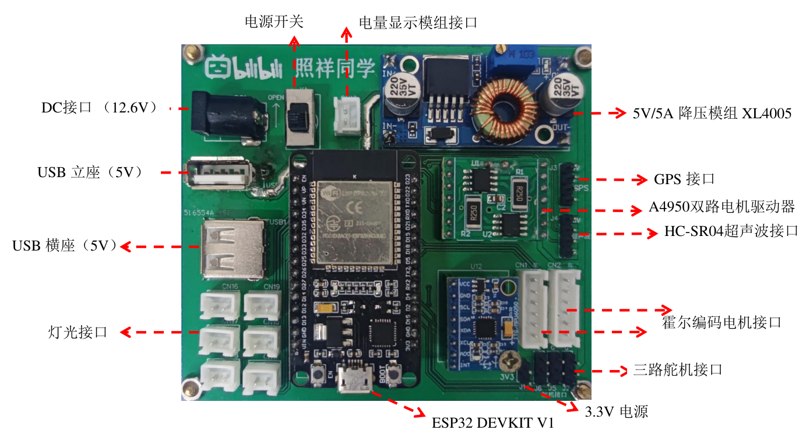
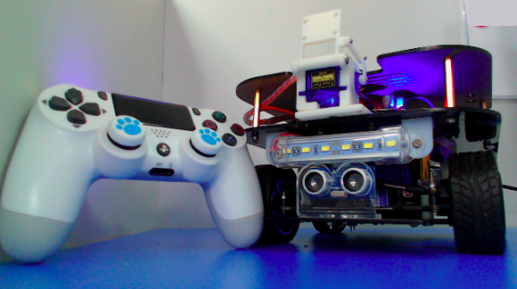
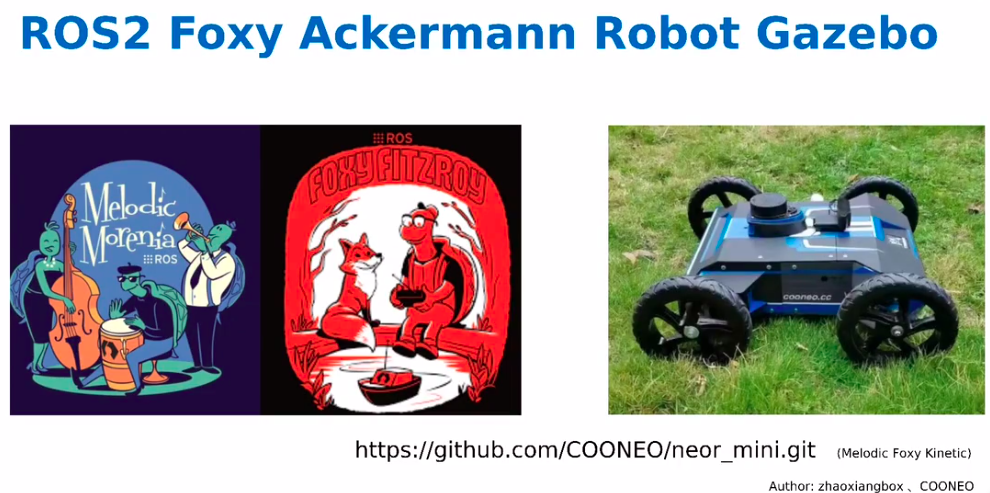

整个项目的目标：构建基于ESP32-WROOM-32开发的ROS机器人

​	1、设计一款 ESP32-WROOM-32 的扩展板，具备以下功能：

- [x] ​		· 带 两路霍尔编码器的直流减速电机接口 

- [x] ​		· 带 3路舵机 PWM 控制接口

- [x] ​		· 带 1路HC-SR04 超声波接口

- [x] ​		· 带 MPU6050 模块

- [x] ​		· 带 GPS 模块

- [x] ​		· 带 2路 LED 控制接口

- [x] ​		· 带 5V/3A 的负载输出

- [x] ​		· 带 A4950T 模组接口

- [x] ​		· 电量显示模组接口


​	2、ESP32 和 该扩展板将实现如下功能

- [x] ​		·基于micro ros 与ROS2 主机进行通信

- [x] ​		· 订阅 速度话题 cmd_vel 

- [ ] ​		· 发布 IMU 、GPS 、Ultrasonic 话题数据

- [ ] ​		· 适配两轮差速小车、差速履带小车、基于舵机转向的阿克曼小车

- [x] ​		· 可通过Wifi、Serial的方式在ROS层面控制ESP32

- [ ] ​		· 后续还需要开发 App （展望）


​	3、设计对应的硬件结构

- [ ] ​		· 差速小车

- [ ] ​		· 差速履带小车

- [x] ​		· 基于舵机转向的阿克曼小车




​                                                                                                                                  **(该PCB板和师弟：[lulipro](https://github.com/lulipro) 共同完成)**




**PS**. 边学边更新，我之前的项目中有详细的 ROS1 学习教程，及ROS2 foxy 的仿真，链接如下：

**[neor_mini](https://github.com/COONEO/neor_mini)** 

```
https://github.com/COONEO/neor_mini
```



ROS 2 foxy 阿克曼仿真链接：[ROS2 Foxy 阿克曼移动机器人仿真实现](https://www.bilibili.com/video/BV1Za41137Ev/)

