整个项目的目标：构建基于ESP32-WROOM-32开发的ROS机器人

​	1、设计一款 ESP32-WROOM-32 的扩展板，具备以下功能：

​		· 带 两路霍尔编码器的直流减速电机接口

​		· 带 3路舵机 PWM 控制接口

​		· 带 1路HC-SR04 超声波接口

​		· 带 MPU6050 模块

​		· 带 GPS 模块

​		· 带 6路 LED 控制接口

​		· 带 5V/3A 的负载输出

​		· 带 A4950T 模组接口

​		· 电量显示模组接口

​	2、ESP32 和 该扩展板将实现如下功能

​		·基于micro ros 与ROS2 主机进行通信

​		· 订阅 速度话题 cmd_vel 

​		· 发布 IMU 、GPS 、Ultrasonic 话题数据

​		· 适配两轮差速小车、差速履带小车、基于舵机转向的阿克曼小车

​		· 可通过Wifi、Serial的方式在ROS层面控制ESP32

​		· 后续还需要开发 App （展望）

​	3、设计对应的硬件结构

​		· 差速小车

​		· 差速履带小车

​		· 基于舵机转向的阿克曼小车


**PS**. 边学边更新，我之前的项目中有详细的 ROS1 学习教程，及ROS2 foxy 的仿真，链接如下：

**[neor_mini](https://github.com/COONEO/neor_mini)** 

```
https://github.com/COONEO/neor_mini
```

------

## Chapter 1 install_Arduino_ROS2_ESP32


Videos from Bilibili 照祥同学: [第一节：搭建ESP32和Arduino的ROS2开发环境](https://www.bilibili.com/video/BV1Rh41177Af/)

#### First : Install ROS2 Foxy in Ubuntu 20.04

Reference to: 

​	1、鱼香ROS一键安装 Page： https://fishros.com/install/install1s/docs/index.html#/

```yaml
wget http://fishros.com/install -O fishros && . fishros
```

	2. ROS Foxy Page: https://docs.ros.org/en/foxy/Installation/Ubuntu-Install-Debians.html


#### Second :Download Arduino IDE 2.0.4 and Install ESP32-WROOM-32 Board

 1.Download Arduino IDE 2.0 [Download the latest release](https://downloads.arduino.cc/arduino-ide/arduino-ide_latest_Linux_64bit.AppImage?_gl=1*18hna5h*_ga*MTk2NTU5MDE3OC4xNjgxNDczNzg0*_ga_NEXN8H46L5*MTY4MTQ3Mzc4My4xLjAuMTY4MTQ3Mzc4My4wLjAuMA..).

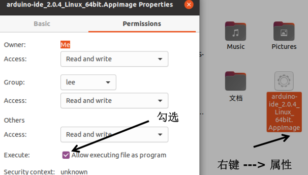


2. Install ESP32-Board in Arduino IDE

​	**·ESP32 Board URL**

```
https://espressif.github.io/arduino-esp32/package_esp32_dev_index.json
```

​	**·Additional Boards Manager** 

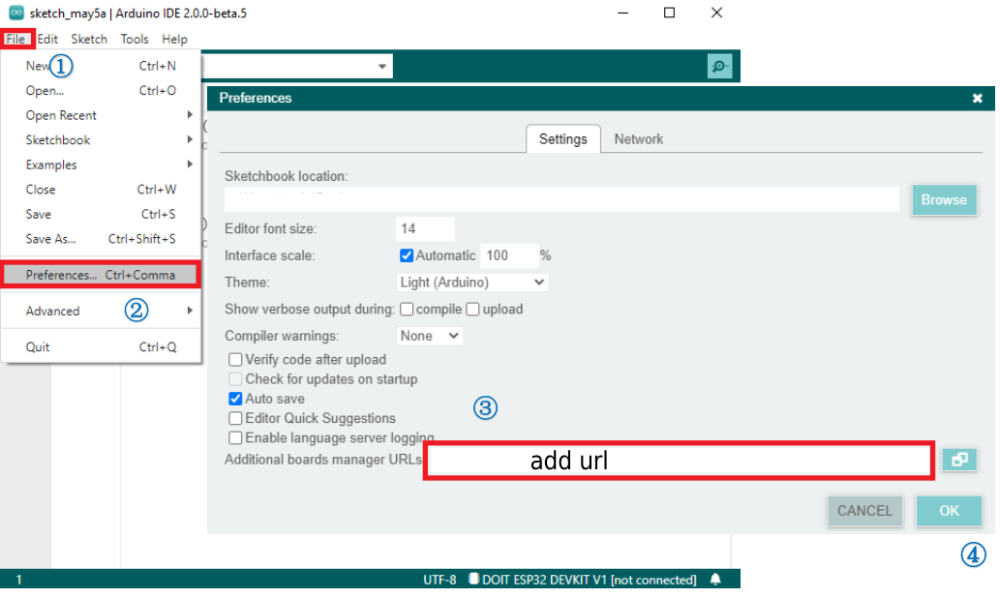


**·Install ESP32 Board **

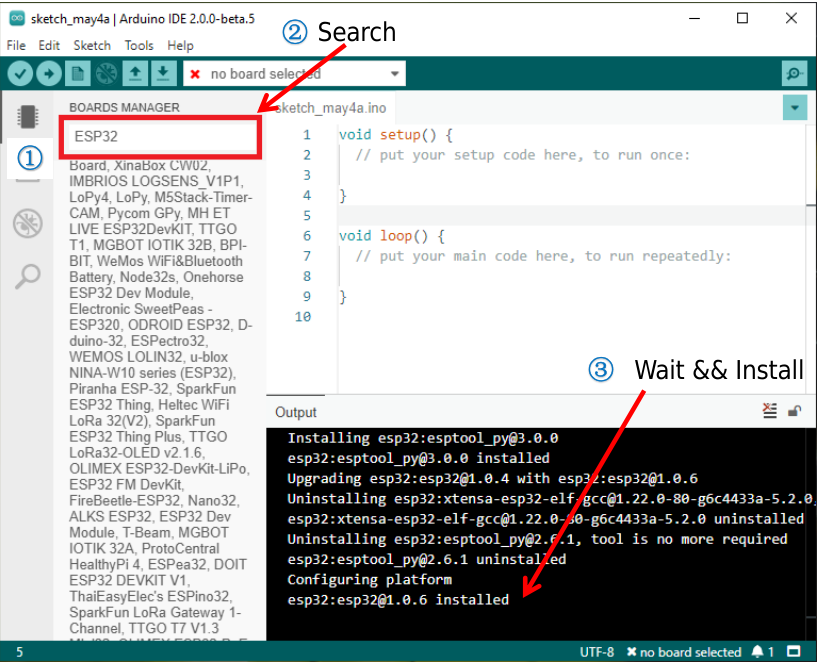


**· Select ESP32 Dev Module && Port ID**

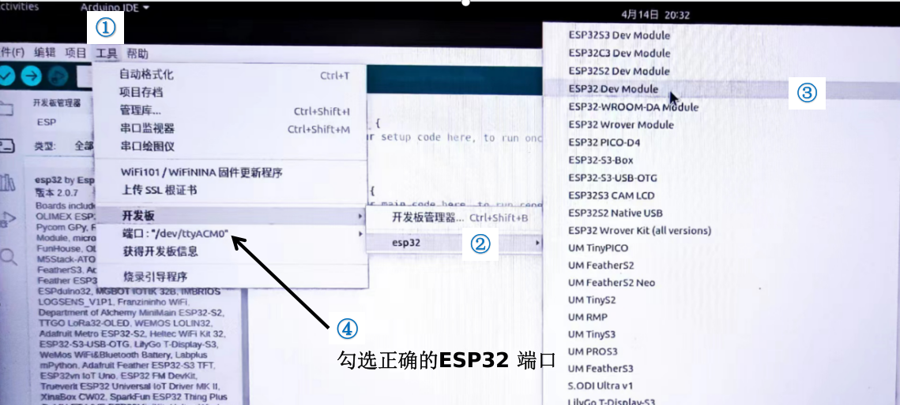

------


## Chapter 2 install_micro_ros


Videos from Bilibili 照祥同学: [第二节：安装micro_ros 的 Arduino 开发环境](https://www.bilibili.com/video/BV1LM4y1y7TD/)

#### First : Install micro-ROS Application On Ubuntu 20.04

Ref Url : [**Teensy with Arduino**](https://micro.ros.org/docs/tutorials/core/teensy_with_arduino/)

```yaml
# Source the ROS 2 installation
source /opt/ros/$ROS_DISTRO/setup.bash

# Create a workspace and download the micro-ROS tools
mkdir microros_ws
cd microros_ws
git clone -b $ROS_DISTRO https://github.com/micro-ROS/micro_ros_setup.git src/micro_ros_setup

# Update dependencies using rosdep
sudo apt update && rosdep update
rosdep install --from-paths src --ignore-src -y

# Install pip
sudo apt-get install python3-pip

# Build micro-ROS tools and source them
colcon build
source install/local_setup.bash
```


#### Second : Creating a new firmware workspace

```
# Download micro-ROS agent packages
ros2 run micro_ros_setup create_agent_ws.sh
```


**Tips**: May need update your cmake version to 3.16.3

```
# Build step
ros2 run micro_ros_setup build_agent.sh
source install/local_setup.bash
```

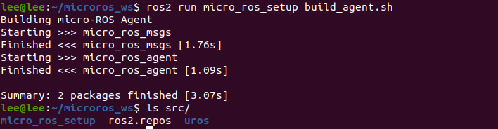


#### Third : Download micro_ros_arduino Library from github

Download URl : **[micro_ros_arduino ](https://github.com/micro-ROS/micro_ros_arduino)**     (**Tips**: branch: foxy)

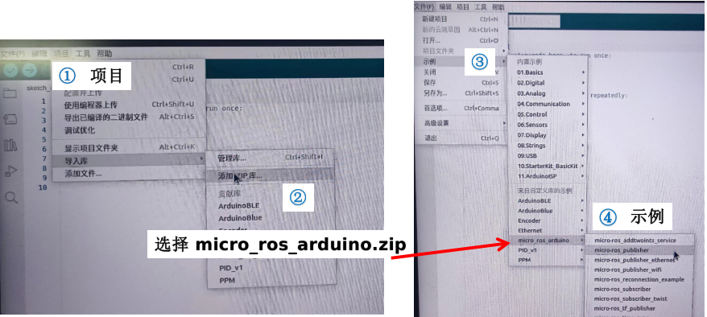


#### Fourth : communication with serial 

example : **micro_ros_publisher**

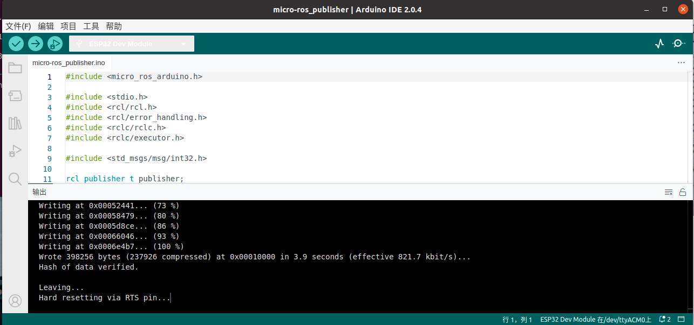

**Tips**: May be need Permission before upload code into esp32 board.

```yaml
sudo chmod 0777 /dev/ttyACM0
```


**·Run micro_ros_agent** 

```yaml
cd microros_ws
source install/setup.bash
ros2 run micro_ros_agent micro_ros_agent serial --dev /dev/ttyACM0
```

Tips: Run the ros2 node ,and then press the boot button on the ESP32 Board, you will see.

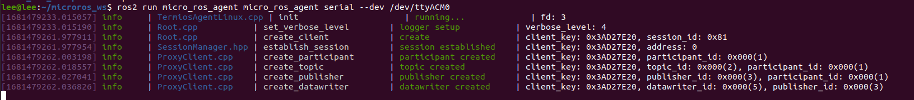


**·Open another Terminal and Subscribe the Topic by ESP32 pub**

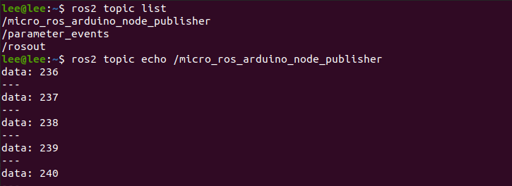


You can try other example !!!                                  

**update by zhaoxiangli 2023.04.14**

------


## Chapter 3 ESP32_Hall_Encoder_Motor


Videos from Bilibili 照祥同学: [第三节：ESP32捕获霍儿编码电机的脉冲](https://www.bilibili.com/video/BV1La4y1K7mN/)

#### First : Connect Motor's Hall Encoder Sensor with ESP32

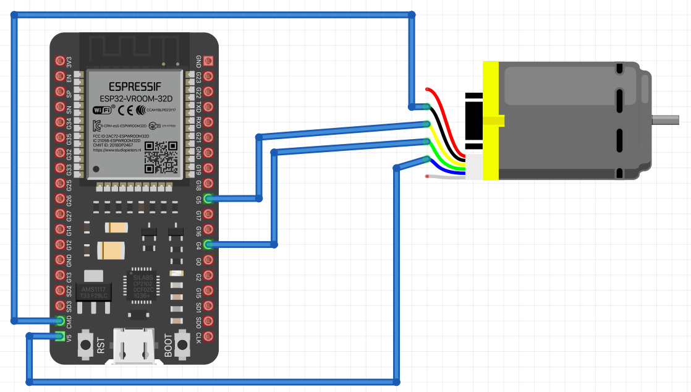

​																																								（From Fritzing）

```yaml
接线说明：
	霍尔传感器正极 +（蓝色）   <------->  ESP32_Vin (5.0V)
	霍尔传感器负极 - （黑色）   <------->  ESP32_Gnd (0V)
	编码器 Encoder A（绿色）   <------->  ESP32_GPIO4 (Input)
	编码器 Encoder B（黄色）   <------->  ESP32_GPIO5 (Input)
```


------


## Chapter 4 ESP32_HC_SR04


Videos from Bilibili 照祥同学: [第四节：使用ESP32获取超声波传感器的测量值](https://www.bilibili.com/video/BV1Rv4y1J73M/)

#### First : Connect HC_SR04 Sensor with ESP32

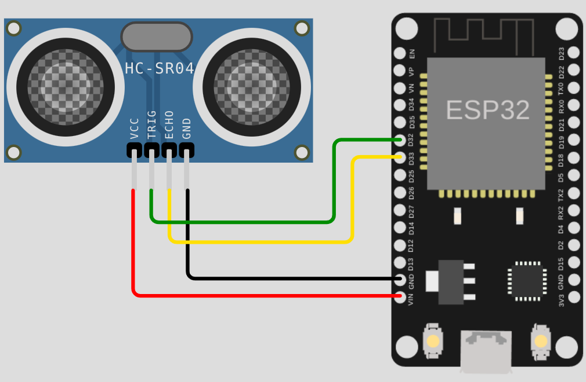


```
接线说明：
	超声波传感器正极 +（红色）   <------->  ESP32_Vin (5.0V)
	超声波传感器负极 -（黑色）   <------->  ESP32_Gnd (0V)
	声波发生引脚 TRIG（绿色）   <------->  ESP32_GPIO32 (Output)
	声波接收引脚 ECHO（黄色）   <------->  ESP32_GPIO33 (Input)
```

**update by zhaoxiangli 2023.04.16**

------


## Chapter 5 ESP32_MPU6050_Module


Videos from Bilibili 照祥同学: 

#### First : Install Adafruit_mpu6050 library


#### Second : Connect MPU6050 Module with ESP32

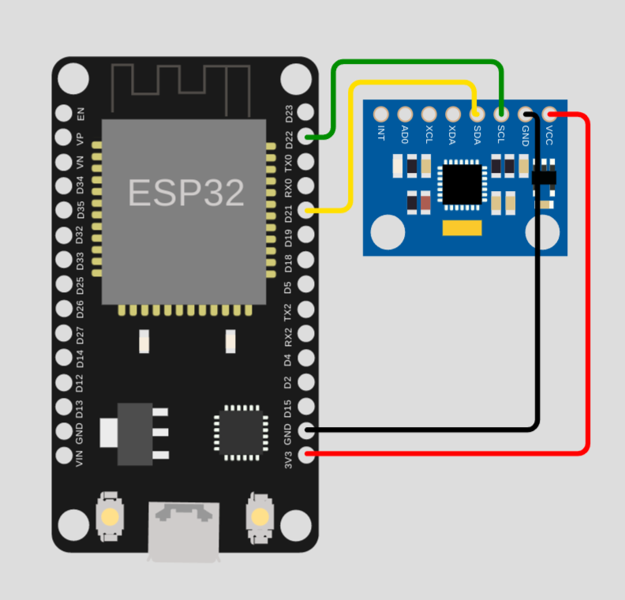


```
接线说明：
	MPU6050 正极 +（红色）<------->  ESP32_Vin (3.3V)
	MPU6050 负极 -（黑色）<------->  ESP32_Gnd (0V)
	数据引脚 SCL（绿色）   <------->  ESP32_GPIO22 (Output)
	数据引脚 SDA（黄色）   <------->  ESP32_GPIO21 (Input)
```


**·MPU6050 IIC 通讯示意图**


**·ROS Imu Msg**

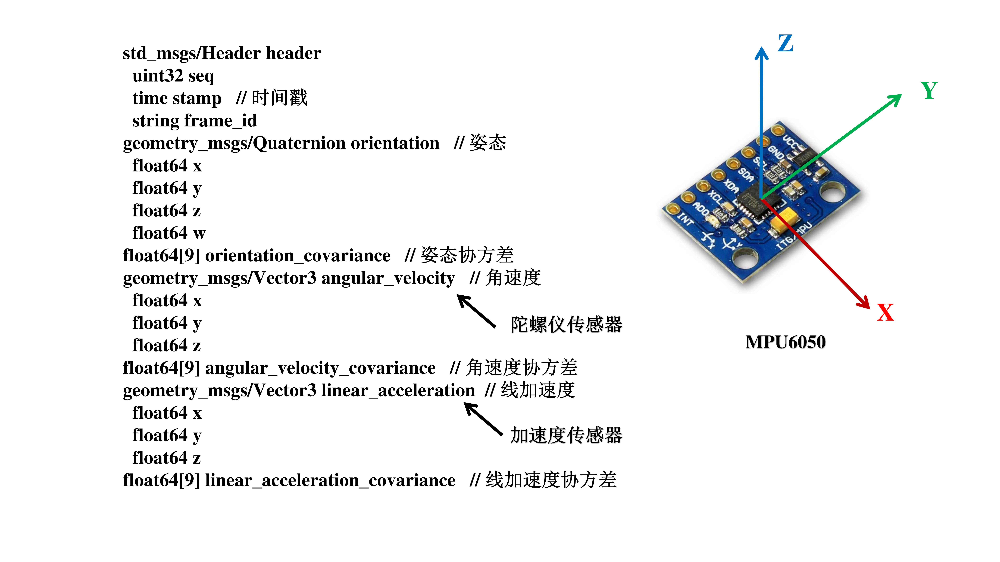

------


## Chapter 6 ESP32_GPS_BDS_Module

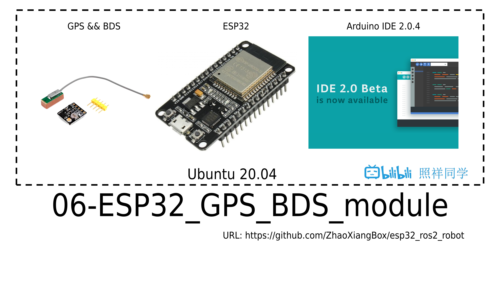

Videos from Bilibili 照祥同学: [第六节：ESP32通过串口获取定位数据](https://www.bilibili.com/video/BV1tL411v7rR/)

#### First : Connect MPU6050 Module with ESP32

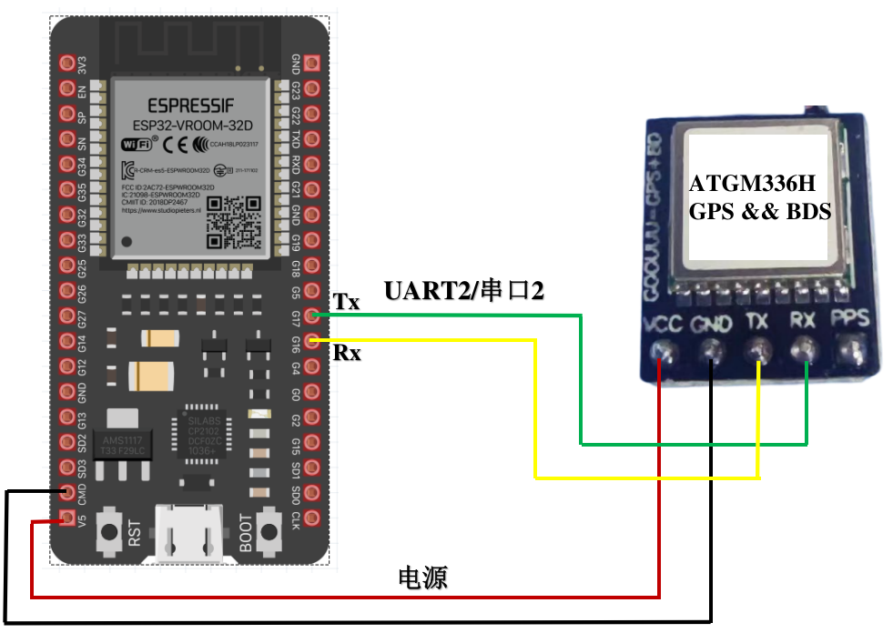


```
接线说明：
	GPS 正极 +（红色）<------->  ESP32_Vin (5.0V)
	GPS 负极 -（黑色）<------->  ESP32_Gnd (0V)
	数据引脚 Rx（绿色）<------->  ESP32_GPIO17 (Tx2 Ouput)
	数据引脚 Tx（黄色）<------->  ESP32_GPIO16 (Rx2 Input)
```

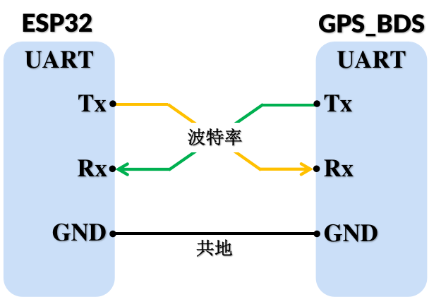


#### Second : ATGM336H GPS_BDS Module Output message.

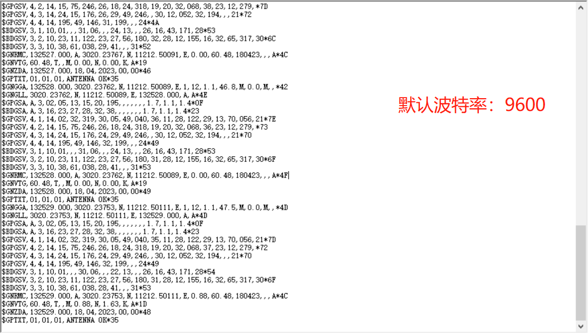

​		该定位模组可搜索GPS和北斗卫星导航信号，通过**串口**的方式输出定位信息，串口输出协议参照 NMEA0183 的规定，如上截图，在开阔位置定位模组的输出帧开头通常有：$GPGSV、$BDGSV、**$GNRMC**、$GNVTG、$GNZDA、$GNTXT、$GNGGA、$GNGLL等开头字样，这些不同帧头的数据帧内部包含内容均在 NMEA-0183（美国国家海洋电子协会为海用电子设备制定的标准格式）标准中有说明。

**· ROS GPS Msg**


```C
串口输出信息解释：
	Save_Data.UTCTime = 121100.000  // hhmmss.sss (小时分钟秒钟.秒钟) 12:11:00 格林威治时间
	Save_Data.latitude = 3020.26146 // ddmm.mmmmm(度分)30度20分
	Save_Data.N_S = N               // 北半球
	Save_Data.longitude = 11212.49989 // ddmm.mmmmm(度分)112度12分
	Save_Data.E_W = E               // 东半球
```


**update by zhaoxiangli 2023.04.18**

------


## Chapter 7 ESP32_GPS_BDS_Module

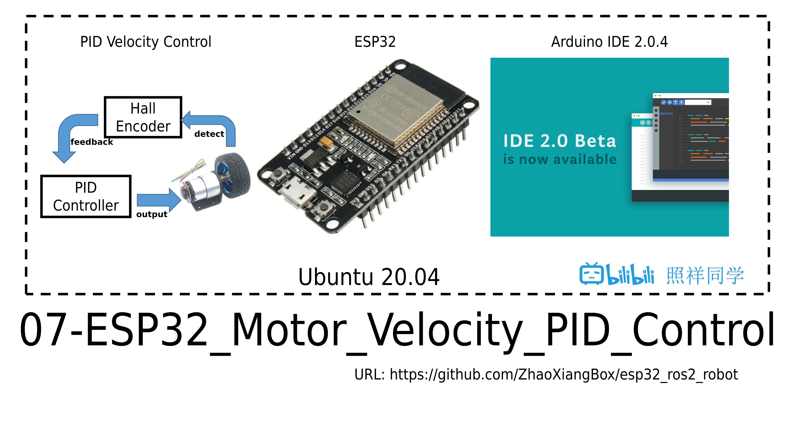

Videos from Bilibili 照祥同学:[第七节：ESP32通过PID实现霍尔编码电机的速度控制](https://www.bilibili.com/video/BV19h411E7uf/)

------

#### First : ESP32 Arduino PWM servo test

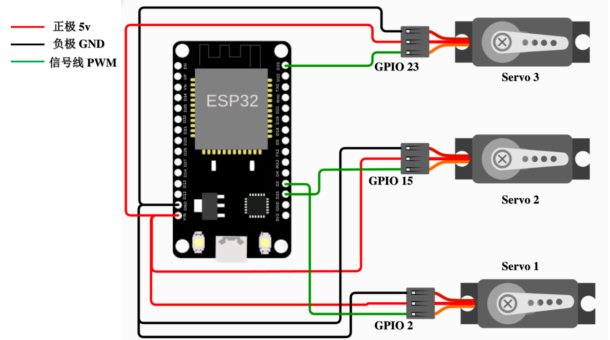


**·Code Tips:**

```c
// 定义PWM输出引脚为 GPIO2
#define Servo_Pin1 2     
  
int freq = 50;    // 频率为50Hz,即周期为20ms
int channel = 8 ; // ESP32一共有16个PWM通道[0,15]，其中前8个为高速PWM(80MHz)，后8个为低速(1MHz)
int resolution = 8; // 引脚输出的分辨率为 8bit 即范围为【0，255】
  
// 分别设置 每路 PWM 输出的通道、频率、引脚输出时的分辨率
ledcSetup(channel,freq,resolution);

// 给指定的GPIO引脚绑定 PWM通道
ledcAttachPin(Servo_Pin1,channel);
```


#### Second : Define a protocol of Serial communication

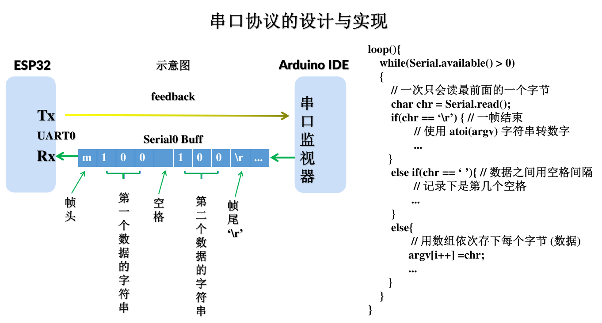


#### Third : Serial A4950T PWM Velocity test

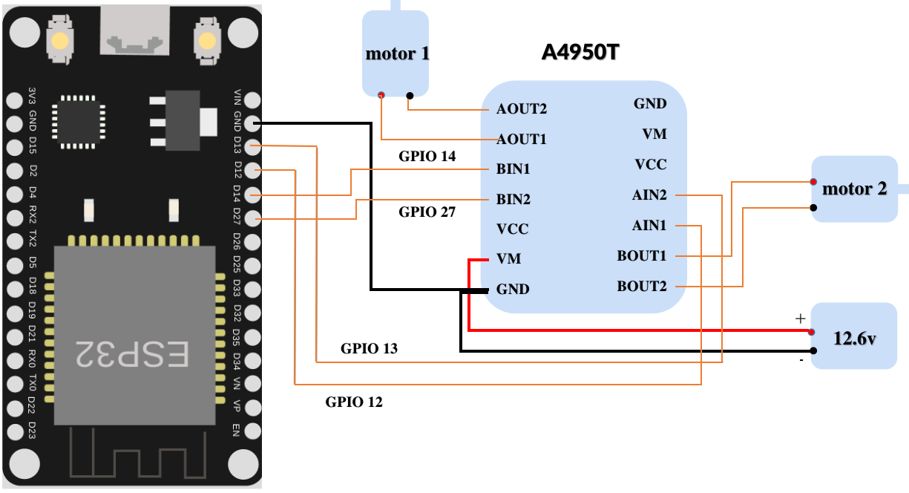


**· Code Tips **

```c
// 左边电机转动方向控制位 引脚
#define Back_Left_D1 12
#define Back_Left_D1_B 13

// 右边电机转动方向控制位 引脚
#define Back_Right_D1 14
#define Back_Right_D1_B 27

void setSpeeds(int m1Speed, int m2Speed){
  if(m1Speed > 0){    // 控制左侧电机
    analogWrite(Back_Left_D1, m1Speed);
    analogWrite(Back_Left_D1_B, LOW);
  }
  else{
    analogWrite(Back_Left_D1, LOW);
    analogWrite(Back_Left_D1_B, -m1Speed);  
  }

  if(m2Speed > 0){    // 控制右侧电机
    analogWrite(Back_Right_D1, m2Speed);
    analogWrite(Back_Right_D1_B, LOW); 
  }
  else{
    analogWrite(Back_Right_D1, LOW);
    analogWrite(Back_Right_D1_B, -m2Speed); 
  }
}
```


#### Fourth : PID controller for Motor Velocity

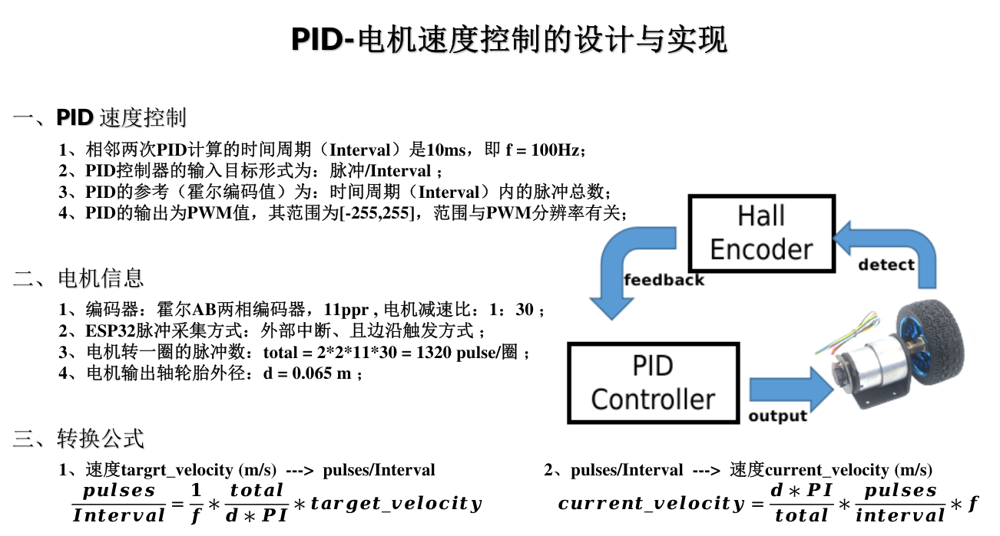


**· Code Tips **

```c
// 需要留意的是：本次只对一个电机进行了PID调速，所以只用到了一组编码器；
// "encoder_driver.h" 中
void Init_Encoder() {
  resetEncoders();
  pinMode(LEFT_ENCODER_A, INPUT);
  pinMode(LEFT_ENCODER_B, INPUT);
    
  // Attaching the ISR to encoder Left A B
  attachInterrupt(digitalPinToInterrupt(LEFT_ENCODER_A), Left_encoder_isr_A, CHANGE);
  attachInterrupt(digitalPinToInterrupt(LEFT_ENCODER_B), Left_encoder_isr_B, CHANGE);
    
  // 若同时对两个电机调速，需要解除如下程序的注释
  // pinMode(RIGHT_ENCODER_A, INPUT);
  // pinMode(RIGHT_ENCODER_B, INPUT);
    
  // Attaching the ISR to encoder Rigth A B
  // attachInterrupt(digitalPinToInterrupt(RIGHT_ENCODER_A), Right_encoder_isr_A, CHANGE);
  // attachInterrupt(digitalPinToInterrupt(RIGHT_ENCODER_B), Right_encoder_isr_B, CHANGE);
}
```

**Tips:** 

​	1、整个速度控制对于目标脉冲为0时，采用的是自由停车的方式，即：停止PID运算，电机自由停车。程序中使用了一个标志位 moving 来判断目标脉冲值是否为 0 。

​	2、对于新手如何使用本程序，后续会出一期增刊视频，专门讲解如何调整PID参数和如何判断电机接线正确。	3、速度控制的方式很多，我只是用了其中的一种，非常欢迎大佬能提出宝贵的建议和更高效简洁的办法。

​	4、由于ESP32没有专门的编码器解码器，这里采用的是外部中断的方式记录脉冲值，所以建议使用霍尔编码电机。如果使用分辨率非常高的光电编码器，由于电机转动起来进入中断的次数太频繁了，会影响主程序运行。

[第七节：补充说明部分](https://www.bilibili.com/video/BV11v4y1E7SR/)

**update by zhaoxiangli 2023.04.21**

------


## Chapter 8 :ESP32_Foxy_Sub_Pub_Topic_by_MicroROS_WIFI


Videos from Bilibili 照祥同学:[第8节 ESP32通过WiFi和ROS2通信](https://www.bilibili.com/video/BV1Qa4y1P7AY/)

------

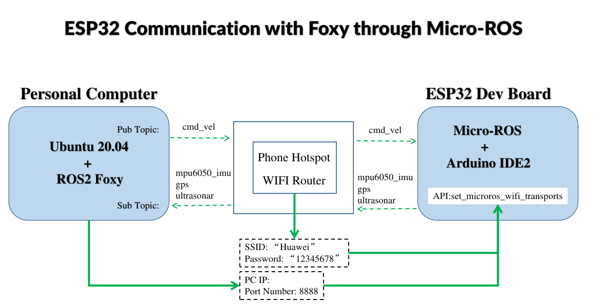

#### First : Setup a WIFI Hotspot 

​	**·Such as my Xiaomi Phone's Hotspot:**

```c
  // Huawei 是WIFI热点的名字
  // 12345678 是WIFI的密码
```


#### Second : Let PC connect this hotspot and remember it's IP number

​	**·open a terminal and input " ifconfig" command :**

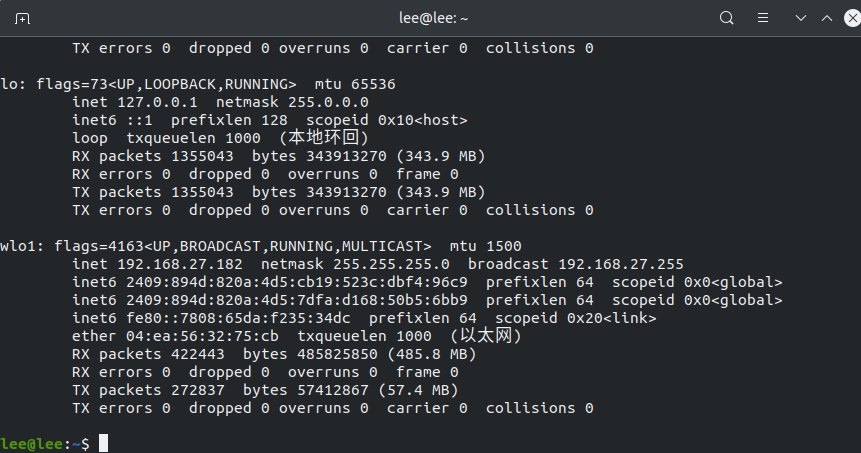


#### Third : Check the WIFI information in ESP32 Code 

```c
  /******************************************************************************
  // set_microros_wifi_transports("Huawei", "12345678", "192.168.27.182", 8888)的意义
  // Huawei 是WIFI热点的名字
  // 12345678 是WIFI的密码
  // 192.168.27.182 是WIFI热点给笔记本电脑分配的IP
  // 8888 是局域网内ROS2消息传输的端口号，后续在电脑端运行 micro_ros_agent 时候需要加载的参数
  ******************************************************************************/
  set_microros_wifi_transports("Huawei", "12345678", "192.168.27.182", 8888);
```


#### Fourth : Run micro_ros_agent for wifi

​	**·open a terminal**

```c
cd microros_ws     // cd in your micros workspace
source install/setup.bash // source
ros2 run micro_ros_agent micro_ros_agent udp4 -p 8888   // run micro_ros_agent in ubuntu
```

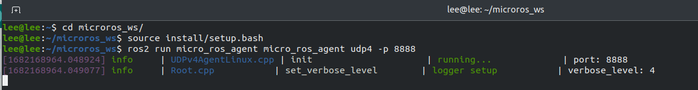


​	**·then press the ESP32 Reset Button.**

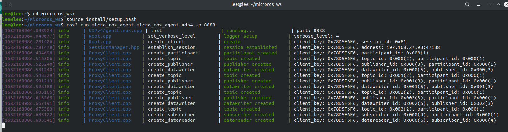


​	**· ros2 topic list**

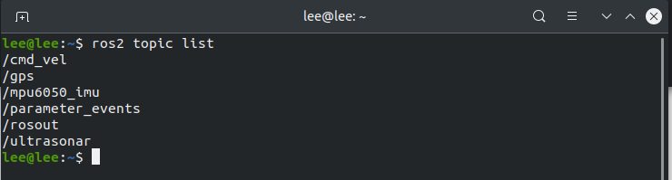

**update by zhaoxiangli 2023.04.23**

------


## Chapter 9:ESP32_Foxy_Sub_Pub_Topic_by_MicroROS_Serial


Videos from Bilibili 照祥同学: [第九节 : ESP32基于micro-ros通过串口代理发布和订阅ROS2的topic](https://www.bilibili.com/video/BV1Xg4y177Nc/)

------

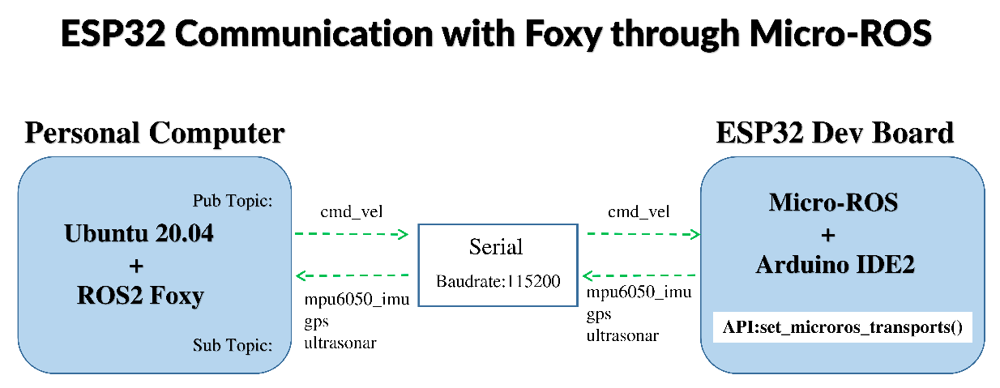


**· open a terminal**

```c
cd microros_ws     // cd in your micros workspace
source install/setup.bash // source
ros2 run micro_ros_agent micro_ros_agent serial --dev /dev/ttyACM0 
```

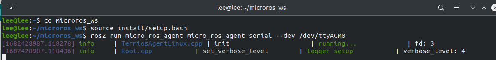

​	**·then press the ESP32 Reset Button.**

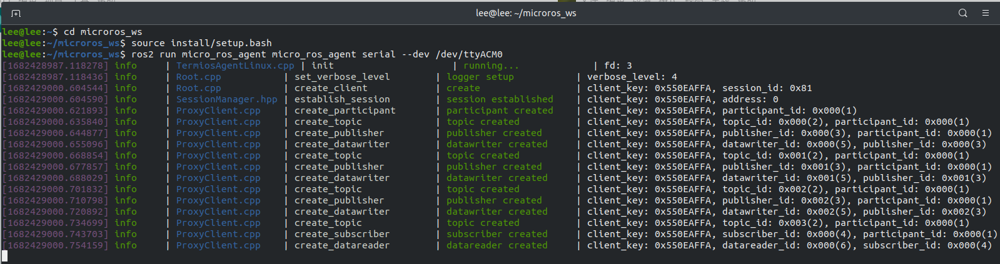

------

#### First : Create a node with default configuration

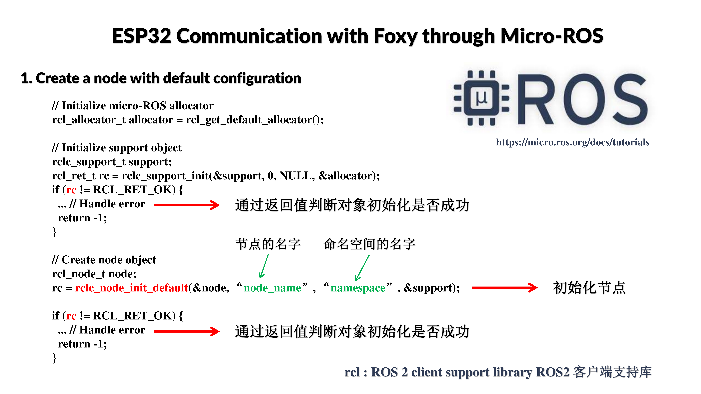

------

#### Second : Initialize a publisher by best effert

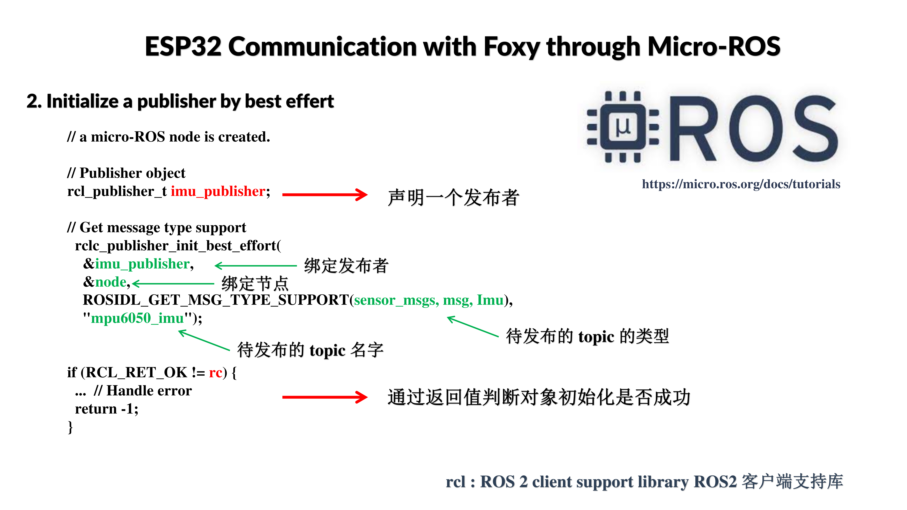

------

#### Third : Initialize a subscriber by default


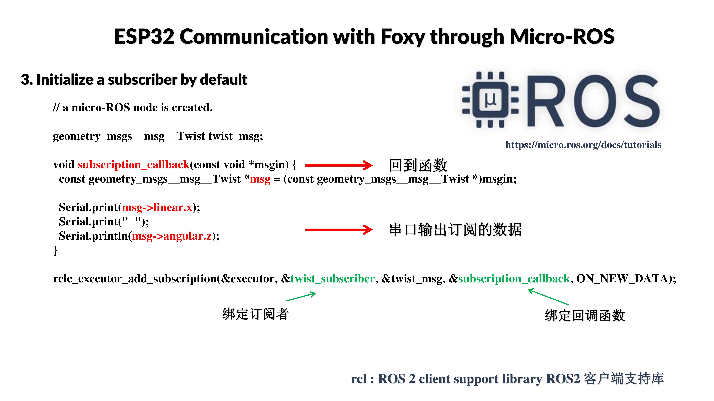

#### URL Link : [Programming with rcl and rclc](https://micro.ros.org/docs/tutorials/core/overview/#collapse-9)

**update by zhaoxiangli 2023.04.25**

------


## Chapter 10 ESP32_Kinematics_Ackerman_micro_ros_WIFI


Videos from Bilibili 照祥同学: [第十节：ESP32订阅Topic并实现阿克曼小车的运动学解算](https://www.bilibili.com/video/BV1PM411G7Cj/)

------

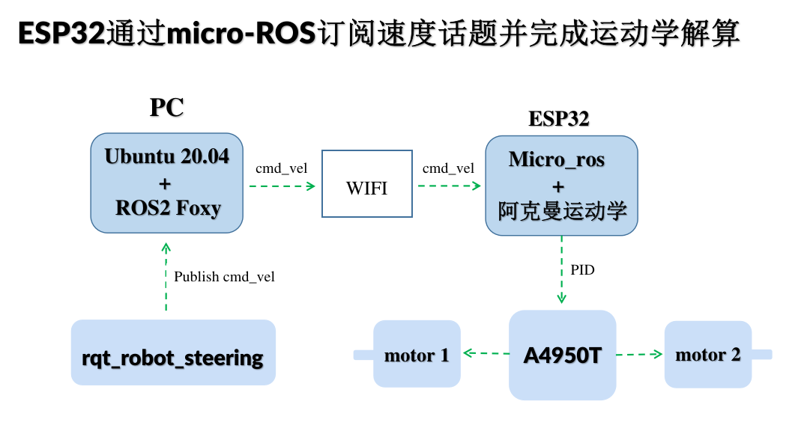

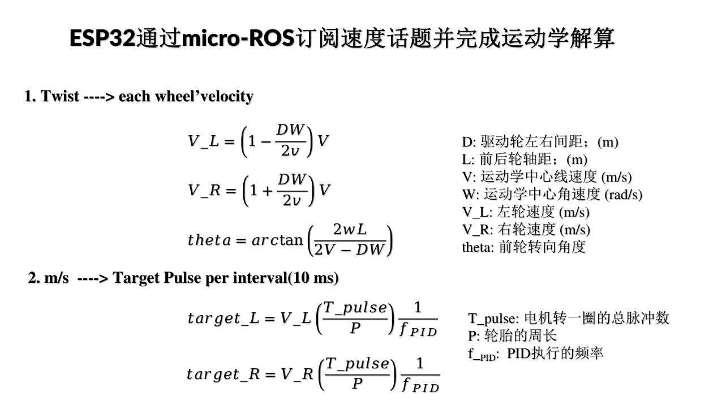

**update by zhaoxiangli 2023.04.26**

------

